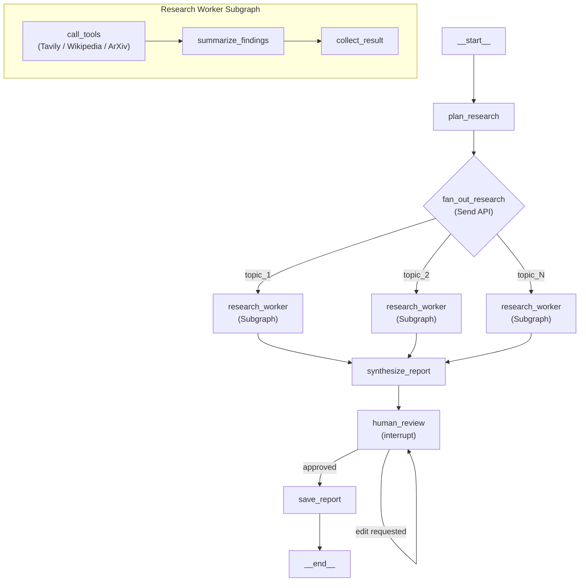

# DeepLens

An autonomous research agent built with LangGraph that decomposes queries into parallel sub-topics, researches them using multiple tools, and produces structured reports with human-in-the-loop review.

I chose to build a **Research Agent** for this assessment to demonstrate advanced LangGraph patterns including subgraphs, map-reduce parallelization, human-in-the-loop feedback, streaming, persistence, and long-term memory — all in a single-file, deployment-ready codebase.

---

## Architecture



### Node Descriptions

| Node | Purpose | LangGraph Concept |
|------|---------|-------------------|
| `plan_research` | LLM decomposes query into 2-4 sub-topics | Structured output (Pydantic) |
| `fan_out_research` | Dispatches parallel workers via `Send()` | Map-Reduce, Parallelization |
| `research_worker` | Calls tools and summarizes findings | Subgraph |
| `synthesize_report` | Merges all worker results into a report | Reducer (`Annotated[list, operator.add]`) |
| `human_review` | Pauses for user approval or edit instructions | Human-in-the-loop (`interrupt`) |
| `save_report` | Persists report to cross-thread memory store | Long-term memory (`Store`) |

---

## Features

**Core**
- Autonomous multi-tool research (Tavily, Wikipedia, ArXiv)
- Parallel sub-topic research via `Send` API (map-reduce)
- Structured report output validated with Pydantic
- Worker subgraph for modular tool execution

**Human-in-the-Loop**
- `interrupt()` pauses execution for human review
- Approve or provide edit instructions for report revision
- Edit loop feeds original research data back for better revisions

**Persistence and Memory**
- Checkpointer (`MemorySaver`) for state persistence across runs
- `InMemoryStore` for saving research across threads (long-term memory)
- Time travel via `get_state_history()` with checkpoint inspection

**Deployment**
- `langgraph.json` for `langgraph dev` (Studio) and `langgraph up` (Docker)
- LangSmith tracing integration
- Swappable LLM via environment variable

---

## Getting Started

```bash
git clone https://github.com/vinayakpareek-0/DeepLens.git
cd DeepLens
pip install -r requirements.txt
cp .env.example .env   # Add your API keys
python agent.py        # Interactive CLI
```

For LangGraph Studio:

```bash
pip install "langgraph-cli[inmem]"
langgraph dev
```

---

## Environment Variables

```
GROQ_API_KEY=your-groq-api-key
TAVILY_API_KEY=your-tavily-api-key
LANGSMITH_API_KEY=your-langsmith-api-key
MODEL_NAME=llama-3.3-70b-versatile
```

---

## Tech Stack

| Component | Choice |
|-----------|--------|
| Framework | LangGraph |
| LLM | Groq (Llama 3.3 70B) |
| Tools | Tavily (web), Wikipedia (knowledge), ArXiv (papers) |
| Validation | Pydantic v2 |
| Persistence | LangGraph MemorySaver |
| Long-term Memory | LangGraph InMemoryStore |
| Tracing | LangSmith |
| Deployment | langgraph.json |

---

## Project Structure

```
DeepLens/
├── agent.py           # All graph logic (single file)
├── langgraph.json     # LangGraph deployment config
├── pyproject.toml     # Project metadata
├── requirements.txt   # Dependencies
├── .env.example       # Environment variable template
└── .gitignore
```

---

## CLI Commands

| Command | Description |
|---------|-------------|
| `<query>` | Run a research query |
| `/history` | View past research from memory store |
| `/travel <thread_id>` | Inspect checkpoint history for a thread |
| `/quit` | Exit the CLI |

---

## License

MIT
